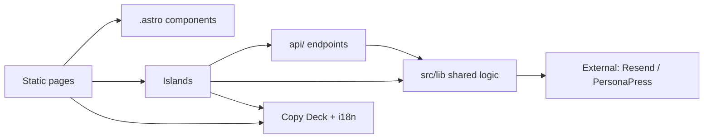
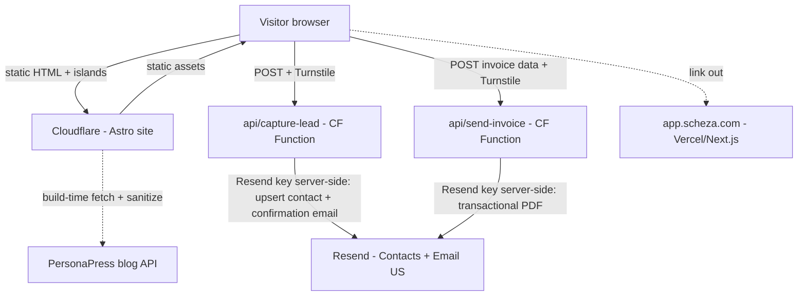
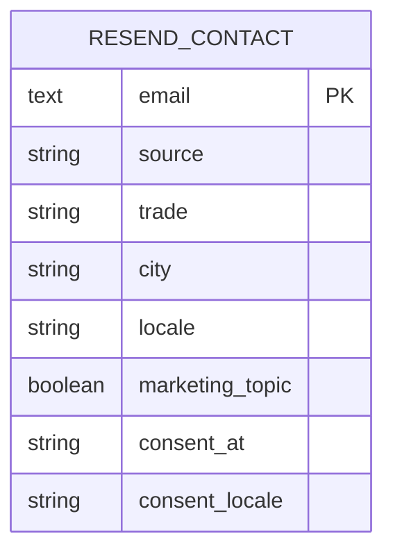

# Architecture Spine — Scheza Marketing Site

## Design Paradigm

**Static-first islands with trust-guarding edge endpoints.** Pages are static HTML by default; interactivity is added only as isolated **islands**; server code exists only as a thin set of **edge endpoints**. Endpoints exist for two reasons: to hold **secrets**, and to be the **single trusted author of any data the business relies on** (leads, consent). The default is zero-JS static pages (what the SEO/AEO/GEO + Core Web Vitals guarantee needs); JavaScript ships only where an island demands it; and the browser is never trusted to write business-truth directly.

**Lead store:** the marketing site has **no database of its own**. Leads are stored as **Resend Contacts** (with custom properties + topics), written server-side by the capture endpoint. This keeps the property database-free and produces the owned, broadcastable email list directly.

Layer → location:
- **Static pages** → `src/pages/**` (Astro `.astro`, pre-rendered).
- **Islands** (interactive, client-hydrated) → `src/islands/**`.
- **Edge endpoints** (secret- or trust-bearing, server-run on Cloudflare) → `src/pages/api/**`.
- **Shared logic** (framework-agnostic) → `src/lib/**`.
- **Copy/content + i18n** → `src/content/**`, `src/i18n/**`.

## Launch Profile (v1) — 2026-10-06 course correction

Added by `sprint-change-proposal-2026-10-06.md`. The paradigm above is **unchanged** — the realized codebase (`scheza-marketing-v1`, promoted into the `scheza-marketing` repo) already follows static-first + Resend-Contacts + no-database. This note records what the **launch cut** does and does not yet include, so the invariants below are read with the right scope at launch:

- **Canonical code:** `scheza-marketing-v1` → `scheza-marketing`. Astro `output: "static"`, `imageService: "passthrough"`, one Worker route `src/pages/api/waitlist.ts`. No D1, no R2 at launch (the `docs/cloudfare.md` D1+R2+SSR stack is a later/north-star profile, not this launch).
- **Brand source of truth:** `scheza-brand-kit` (Ink/Apricot/Vermilion, Manrope+Inter). **Supersedes `docs/visual.png`.**
- **Honored at launch:** AD-1 (static-first), AD-6 (secrets server-only + secret-leak gate), AD-15/16 (whitelist + upsert-by-normalized-email), Resend-Contacts lead store, zero-JS default, WCAG AA axe gate.
- **Deferred (interim risk accepted by PM):** **AD-10 Turnstile** abuse guard and **AD-9 full CASL server-witnessed consent** are not in the launch cut (rate-limiting + server-side validation only). **NFR-5 EN/FR i18n** deferred (launch is EN-only; `src/i18n/**` not yet populated). Constraint: no public copy may assert data-residency or CASL-compliant consent until these land.
- **SEO/AEO/GEO (2026-10-06-seo re-scope):** the launch homepage carries only a thin SEO baseline; **NFR-2/NFR-3** and the comparison/resource content are delivered by **Epic 6** under **AD-21** (`sprint-change-proposal-2026-10-06-seo.md`), demand-validated and scoped to a lean foundation. Static-first and no-database invariants are unchanged. Keyword/answer-engine direction: PRD §14.1.

## Invariants & Rules

### AD-1 — Static-first rendering
- **Binds:** all pages; NFR-1, NFR-2, NFR-3.
- **Prevents:** a builder making a content page SSR/client-rendered and silently breaking Core Web Vitals / crawlability.
- **Rule:** every route is pre-rendered (SSG) by default. On-demand/SSR is allowed **only** for a route that provably cannot be static, and requires an explicit note. Content, positioning, examples, blog, and comparison pages are always static.

### AD-2 — Interactivity only through islands
- **Binds:** FR-1 (preview), FR-7/8/9/10 (calculator), FR-11 (referral link).
- **Prevents:** the site drifting into a heavyweight SPA that defeats the static-first goal.
- **Rule:** client-side interactivity lives in a named island under `src/islands/**`, hydrated with the narrowest directive that works (`client:visible`/`client:idle` over `client:load`). Pages stay static shells that mount islands. No global client router, no app-wide client state framework.

### AD-3 — Endpoints exist for secrets or trust; nothing else
- **Binds:** FR-2, FR-8, FR-11, FR-12, FR-13, FR-14; NFR-7.
- **Prevents:** both backend sprawl **and** the opposite error — trusting the browser with business-truth (or the Resend API key) to avoid a function.
- **Rule:** a server endpoint is created only when an action needs a server-held **secret** or must be the **sole trusted author** of relied-upon data. At launch that is two: lead capture (AD-15) and email send (AD-18). Anything doable safely in the browser or at build time must not become an endpoint.

### AD-4 — One canonical Lead contract, stored as a Resend Contact
- **Binds:** FR-2, FR-8, FR-11, FR-12, FR-13, FR-14.
- **Prevents:** the waitlist, calculator, demo, partner, and referral capture points each inventing a different lead shape.
- **Rule:** every capture produces the **same** logical `Lead` and writes it as a **Resend Contact** keyed by email, with a fixed set of **custom contact properties**: `source ∈ {waitlist, calculator, demo, partner, referral}`, `trade?`, `city?`, `locale`, plus consent state via **Resend topics** (AD-9). Free-text (e.g. a demo `note`) is a string property within Resend's limits. New capture points reuse this shape/enum; adding a property or enum value is a change owned here, never an ad-hoc per-form addition.

### AD-5 — The browser never writes leads directly
- **Binds:** FR-2, FR-14.
- **Prevents:** forged/tampered lead fields, a leaked Resend key, and divergent write paths.
- **Rule:** all lead writes go through the capture endpoint (AD-15) using the **server-held Resend API key**. The browser never calls the Resend Contacts API directly and never holds a write credential for the lead store. Client code calls only `api/capture-lead`.

### AD-6 — Secrets are server-only, enforced in CI
- **Binds:** all; inherited posture from the app.
- **Prevents:** leaking the Resend key or the PersonaPress token into the client bundle.
- **Rule:** only the Turnstile **site** key may reach the browser. All other keys (Resend, PersonaPress) are referenced **only** inside `src/pages/api/**` or build scripts. This is enforced by a **build-failing CI check** (lint/grep gate) that fails if a server-only secret name appears in client-shipped code — mirroring the app's ESLint gate, because Astro's client/server boundary is looser than Next's.

### AD-7 — The free calculator is fully client-side and self-contained
- **Binds:** FR-7, FR-9, FR-10; FR-8 (client-side generation path).
- **Prevents:** coupling the lead magnet to backend/app availability or to an LLM.
- **Rule:** tax math (`src/lib/calc.ts`) and PDF generation (`src/lib/pdf.ts`, `pdf-lib`) run **in the browser** for the on-page download. The calculator's core works with the app and all endpoints offline. Tax rates live in a dated config constant with a "not tax advice" disclaimer. No LLM. (Emailing the PDF is a separate, server-regenerated path — AD-18.)

### AD-8 — Blog is build-time SSG from PersonaPress, degrade-safe and sanitized
- **Binds:** FR-16, FR-17; NFR-2, NFR-3, NFR-7.
- **Prevents:** per-request coupling to an external API, broken pages on outage, and stored XSS from external HTML.
- **Rule:** blog content is fetched from PersonaPress **at build time** and emitted as static HTML with Article structured data, canonical, and hreflang; any HTML from PersonaPress is **sanitized/escaped** at build. Rebuilds refresh content (AD-20). A failed fetch degrades to last-known/empty state, never a broken page. The PersonaPress token is server/build-only (AD-6). Each post has its **own language** (EN or FR) from PersonaPress — posts are content-driven, **not** required to be translated 1:1; render each under its locale route and emit `hreflang` only when a translated counterpart exists.

### AD-9 — Consent is server-witnessed via Resend topics
- **Binds:** FR-14; all capture points.
- **Prevents:** unprovable consent claims and undefined unsubscribe — a CASL violation by construction.
- **Rule:** the marketing opt-in is a separate, **unticked-by-default** control; the capture endpoint (AD-15) sets the contact's **marketing topic subscription** and records the consent timestamp/locale as contact properties. Consent semantics are **identical across EN/FR** (paired copy slots, AD-14). Unsubscribe is handled by Resend's topic/unsubscribe machinery and honored on all sends. The calculator PDF is **transactional** (sent regardless of marketing opt-in). Every marketing send carries sender ID + working unsubscribe.

### AD-10 — Abuse guard verified server-side on every public write
- **Binds:** FR-2, FR-8; NFR-9.
- **Prevents:** bots polluting the contact list and amplifying Resend cost.
- **Rule:** the capture endpoint (AD-15) and the email endpoint (AD-18) each **verify a Cloudflare Turnstile token server-side** before acting, and are rate-limited. Client-only Turnstile is never sufficient.

### AD-11 — Data residency: lead PII lives in Resend (US), by conscious exception
- **Binds:** lead data; NFR-6, NFR-8.
- **Prevents:** an unexamined divergence from the app's ca-central-1 posture.
- **Rule:** the marketing **lead list resides in Resend (US)**, a deliberate, disclosed exception to the app's strict Canadian-residency mandate — PIPEDA-permitted cross-border processing with a **privacy-policy disclosure** ("we use a US email provider for our mailing list"). The app's tenant/customer data remains ca-central-1 and is unaffected (the marketing site never touches it). **If a store is later added for referral attribution (AD-17), it should be ca-central-1**, or the residency exception re-examined. Any analytics receiving PII follows the same disclosure discipline.

### AD-12 — Full decoupling from the app
- **Binds:** scope; NFR-8.
- **Prevents:** entangling the marketing site with the app's Vercel project, Next.js runtime, or database.
- **Rule:** the marketing site is its own repo and its own Cloudflare deploy, with **no shared runtime, no shared database, and no import from the app codebase**. Its lead store is Resend, entirely separate from the app's Supabase. Cross-links to `app.scheza.com` are plain URLs.

### AD-13 — Taste-of-magic preview is canned at launch, behind a seam
- **Binds:** FR-1.
- **Prevents:** a launch dependency on live LLM generation, and a rewrite if that changes later.
- **Rule:** the preview renders a **static, per-trade canned template** (selected by trade + city), with a guaranteed fallback so it never dead-ends. A future live-generation mode arrives as a new edge endpoint (AD-3) swapped behind the same island interface — not by making the preview page dynamic.

### AD-14 — Bilingual by construction
- **Binds:** FR-9, FR-18; NFR-5.
- **Prevents:** hardcoded strings, English-only structure, and EN/FR divergence in load-bearing copy (esp. consent).
- **Rule:** EN/FR via Astro i18n routing (`/` EN, `/fr/**`); every user-facing string and the invoice output come from an externalized Copy Deck slot (`src/content/**`, `src/i18n/**`) as an **EN+FR pair**; pages emit correct `hreflang`. Consent copy and semantics must be paired (AD-9). No copy is hardcoded by the builder (copy is owner-supplied).

### AD-15 — Single validating capture endpoint (writes to Resend)
- **Binds:** FR-2, FR-11, FR-12, FR-13, FR-14.
- **Prevents:** forged fields, capture-point value drift, and Turnstile being un-enforceable.
- **Rule:** **all** captures POST to one endpoint (`api/capture-lead`). It: verifies Turnstile (AD-10); **whitelists** accepted fields and rejects the rest; **derives `source` server-side** (never trusts a client-sent source); validates email; sets consent (AD-9); and **upserts the contact into Resend by email** (AD-16) using the server-held key. It also triggers the confirmation email (via Resend). Islands/forms call only this endpoint.

### AD-16 — Email is the Lead identity; writes are upserts
- **Binds:** FR-2.
- **Prevents:** duplicate contacts and split/contradictory consent.
- **Rule:** normalized `email` is the unique contact identity; the capture endpoint **adds-or-updates** the Resend contact by email (idempotent). Later touches update properties without duplicating; opt-out always wins.

### AD-17 — Referral attribution runs on Cloudflare D1
- **Binds:** FR-11.
- **Prevents:** self-referral, forged referrers, and replay over-counting — which Resend Contacts alone cannot enforce.
- **Rule:** invite links carry a **server-issued opaque referral token**, never a raw contact id. Referral tokens and attributions live in **Cloudflare D1** (SQLite) — chosen over KV because attribution needs a **uniqueness constraint** (one attribution per referred email) and **counts** (the coefficient), which KV cannot enforce. The endpoint resolves token → referrer, rejects self-referral, and records exactly one attribution per referred email; `referrer_id`/attribution is set only server-side. Built in Epic 4; the referral loop ships with it.

### AD-18 — Email endpoint regenerates and self-sends only
- **Binds:** FR-8 (email path); NFR-7.
- **Prevents:** an open relay / cost-amplifier and preview≠sent-PDF mismatch.
- **Rule:** the email endpoint accepts **structured invoice data only** (never client PDF bytes, never a client-chosen recipient), verifies Turnstile (AD-10), **regenerates the PDF server-side** from the same shared `lib/calc` + `lib/pdf`, and sends it **only** to the email captured/verified in this flow, via Resend (transactional, AD-9).

### AD-19 — Accessibility is a build gate
- **Binds:** NFR-4; all pages/islands.
- **Prevents:** an inaccessible site that also loses the SEO/AEO benefit accessibility brings.
- **Rule:** pages and islands meet **WCAG 2.1 AA** (contrast, keyboard nav, focus states, alt text, form labels, reduced-motion). Automated a11y checks (e.g. axe) run in CI (AD-20) on key pages; islands are keyboard-operable and labeled.

### AD-20 — Deployment & operations envelope
- **Binds:** all; NFR-1, NFR-7.
- **Prevents:** an undecided operational envelope (untracked deploys, unmanaged secrets, no rollback, stale blog).
- **Rule:** GitHub → **Cloudflare Pages** deploy; **preview deploy per PR**, **production on merge to main**, **instant rollback** via Cloudflare deployment history. Secrets live in **Cloudflare project secrets/env** (never committed; `.env.example` with placeholders only). CI runs: build, type-check, the AD-6 secret-leak gate, and AD-19 a11y checks. Blog rebuilds trigger via a **PersonaPress webhook** (fallback: scheduled rebuild). Errors report to **Sentry**; traffic/perf via Cloudflare Web Analytics (privacy-friendly, non-PII).

### AD-21 — Comparison & resource pages are static, slot-driven, schema-marked, AEO-extractable, honesty-gated
- **Binds:** FR-17, FR-18; NFR-1, NFR-2, NFR-3. Added by `sprint-change-proposal-2026-10-06-seo.md` (Epic 6).
- **Prevents:** SEO pages drifting into SSR/JS, fabricated competitor claims, coupling to the Epic 5 blog pipeline, and AI-uncitable content.
- **Rule:** `/compare/**` and `/resources/**` are pre-rendered static pages (AD-1) built from Copy Deck slots (AD-14), each carrying content-matched structured data (FAQPage/HowTo/Article + SoftwareApplication/BreadcrumbList). They do **not** depend on PersonaPress (AD-8) or any runtime. For **AEO/GEO** (NFR-3) they MUST expose **extractable question-and-answer prose** and **consistent canonical facts** that answer/generative engines (Google AI Overviews, Bing Copilot, ChatGPT, Perplexity) can cite; crawlable static HTML (AD-1) is the enabling precondition, and no special AI markup / `llms.txt` is required (an optional `/llm-info` canonical-facts page may exist, never as a ranking tactic). Any competitor claim must be verified against that competitor's current public source before publish (PRD §5/§11); unverified claims are omitted, not guessed. Canonical facts must not assert data-residency or CASL-consent guarantees the launch cut has not earned (Launch Profile).

**Dependency direction** (who may depend on whom):



## Consistency Conventions

| Concern | Convention |
| --- | --- |
| Naming — routes | kebab-case; EN at root, FR under `/fr/**` (e.g. `/tools/invoice-calculator`, `/fr/outils/calculatrice-facture`) |
| Naming — islands / components | PascalCase files (`InvoiceCalculator.tsx`, `TradePreview.tsx`); components `.astro`, islands framework files |
| Naming — endpoints | `src/pages/api/` verb-noun files, one action per file (`capture-lead.ts`, `send-invoice.ts`) |
| Lead store | Resend Contacts; email = identity; `source`/`trade`/`city`/`locale` as custom contact properties; consent via topics (AD-4/AD-9) |
| Data — identity | normalized `email` = identity (AD-16); upsert, never duplicate |
| Data — money (calculator) | integer minor units internally; format at render; rates from dated config |
| Capture path | islands/forms → `api/capture-lead` only; never a direct client call to Resend (AD-5/AD-15) |
| Consent | separate unticked opt-in; server-set Resend topic; EN/FR paired copy (AD-9/AD-14) |
| State — client | island-local only; no global client store; no app router |
| Secrets | AD-6: only Turnstile site key client-side; Resend/PersonaPress keys server-only; CI gate enforces |
| Errors | endpoints return `{ data, error }` with a user-facing message; never leak stack/keys |
| Accessibility | WCAG 2.1 AA; axe checks in CI (AD-19) |
| Brand (authoritative) | `docs/visual.png` — Scheza brand guide: logo/wordmark + variants, the navy/blue/cyan color palette (exact hex per the file's swatches), and **Inter** as the primary typeface. This is the source of truth for logo, color, and type. |
| Visual / UX aesthetic | `docs/design.md` — UX philosophy & aesthetic: "Spatial Clean" (depth over borders), no blank states, optimistic UI, touch-first (≥48px hit areas), accessibility. Use for approach, not brand specifics. **Where `design.md` conflicts with `visual.png` on color or typography (design.md's Geist + black/green predate the Scheza brand), `visual.png` wins.** Design *language* is shared with the app; components are Astro (not the app's shadcn). |
| Analytics | consent-aware; UTM on capture events; PII handling follows the AD-11 disclosure |

## Stack

*Seed — verified current on the web at authoring (2026-09-28); the code owns this once it exists. Re-verify pins at cold-start.*

| Name | Version |
| --- | --- |
| Astro | ^7 (7.3.x current; Astro 6 stable since 2026-02) |
| @astrojs/cloudflare (adapter) | ^14 (matches Astro 7 line; supports server endpoints on Pages/Workers) |
| Cloudflare Pages/Workers | platform |
| React (islands, optional) | ^19 |
| Tailwind CSS | v4 (match app) |
| pdf-lib | ^1.17 (pure JS; runs in browser and on workerd) |
| resend | ^6 (Contacts + custom properties + topics + broadcasts; Workers-compatible) |
| Cloudflare Turnstile | current |
| TypeScript | ^5 (strict) |

*(No `@supabase/supabase-js` for the marketing site — the lead store is Resend. A minimal store may be introduced for referral attribution in Epic 4; see AD-17.)*

## Structural Seed

```text
scheza-marketing/               # own repo, own Cloudflare deploy (AD-12)
  astro.config.mjs              # @astrojs/cloudflare adapter, i18n (AD-14)
  .env.example                  # placeholders only (AD-20)
  src/
    pages/                      # routes; static by default (AD-1)
      index.astro               # Home / taste-of-magic (FR-1..3)
      how-it-works.astro        # Examples (FR-4..6)
      tools/invoice-calculator.astro   # mounts Calculator island (FR-7..10)
      early-access.astro        # waitlist + referral + demo + partner (FR-11..13)
      compare/jobber.astro, compare/housecall-pro.astro, compare/servicem8.astro  # SEO/AEO (AD-21)
      resources/[...].astro     # content-moat pages: checklist, templates, admin-cost (AD-21)
      blog/[...slug].astro      # build-time SSG from PersonaPress (FR-16/17)
      fr/**                     # FR mirror of the above
      api/
        capture-lead.ts         # single validating capture endpoint -> Resend (AD-15)
        send-invoice.ts         # regenerate + self-send PDF (AD-18)
    islands/
      TradePreview.tsx          # FR-1 (canned; seam for live-gen, AD-13)
      InvoiceCalculator.tsx     # FR-7..10 (client math + pdf, AD-7)
      ReferralLink.tsx          # FR-11 (opaque token, AD-17 — Epic 4)
    components/                 # .astro presentational + Content Slots (FR-18)
    lib/
      leads.ts                  # thin client that calls api/capture-lead (AD-5)
      resend.ts                 # server-side Resend client (contacts + email), API key server-only
      calc.ts                   # deterministic tax math (AD-7, shared w/ AD-18)
      pdf.ts                    # pdf-lib invoice builder (shared client+server)
      persona.ts                # build-time PersonaPress fetch + sanitize (AD-8)
    content/                    # Copy Deck slots, EN/FR pairs (AD-14)
    i18n/
  .github/workflows/            # CI: build, types, secret-leak gate, a11y (AD-6/19/20)
```

**Container & data flow:**



**Lead (logical shape, stored as a Resend Contact):**



*(Referral attribution — referrer token → referred, self-referral rejection, one-per-email — is not modeled here; it needs the minimal store decided in Epic 4, AD-17.)*

## Capability → Architecture Map

| Capability / Area | Lives in | Governed by |
| --- | --- | --- |
| Taste-of-magic preview (FR-1) | `islands/TradePreview` | AD-1, AD-2, AD-13 |
| Waitlist capture (FR-2) | `islands`/forms → `api/capture-lead` → Resend | AD-4, AD-5, AD-15, AD-16, AD-9, AD-10 |
| Positioning / examples (FR-3..6) | static pages + `components` | AD-1, AD-14 |
| Invoice+Tax calculator (FR-7..10) | `islands/InvoiceCalculator`, `lib/calc`, `lib/pdf` | AD-7, AD-2 |
| Email the PDF (FR-8 delivery) | `api/send-invoice` | AD-18, AD-3, AD-6, AD-9, AD-10 |
| Referral loop (FR-11) | `islands/ReferralLink` + `api/capture-lead` + minimal store | AD-17 (Epic 4), AD-15, AD-4 |
| Demo / pilot (FR-12) | `early-access` + `api/capture-lead` | AD-15, AD-4 (`source=demo`) |
| Partner path (FR-13) | `early-access` + `api/capture-lead` | AD-15, AD-4 (`source=partner`) |
| Consent / CASL (FR-14) | `api/capture-lead` + Resend topics | AD-9, AD-15, AD-16 |
| Testimonials (FR-15) | `components` + `content` | AD-1, AD-14 |
| Blog (FR-16/17) | `pages/blog`, `lib/persona` | AD-8, AD-20 |
| Copy/content (FR-18) | `content`, `i18n` | AD-14 |
| Performance / SEO / AEO / GEO (NFR-1..3) | whole site | AD-1, AD-8, AD-21 |
| Comparison / resource SEO-AEO pages (FR-17) | `pages/compare/**`, `pages/resources/**` + `content` | AD-21, AD-1, AD-14 |
| Accessibility (NFR-4) | whole site | AD-19 |
| Bilingual (NFR-5) | whole site | AD-14 |
| Analytics / instrumentation (NFR-6) | capture events + analytics tool | AD-11 (+ Deferred) |
| Resilience (NFR-7) | endpoints, blog | AD-8, AD-18, AD-20 |
| Hosting / residency (NFR-8) | Cloudflare + Resend (US, disclosed) | AD-11, AD-12, AD-20 |
| Abuse & integrity (NFR-9) | capture + email endpoints | AD-5, AD-10, AD-15, AD-18 |

## Deferred

- **Referral attribution store** — resolved to **Cloudflare D1** (AD-17); built with **Epic 4**, and the referral loop ships with it (store type no longer an open decision).
- **Live LLM preview generation** — canned at launch (AD-13); revisit if it converts materially better (PRD Open Q1). Arrives as a new endpoint behind the island seam.
- **Quebec / multi-province tax** in the calculator — Ontario-only at launch; rates config structured for it (PRD Open Q3). Needs CPA/legal review.
- **Analytics tool choice** (NFR-6) — event set defined; the specific tool is an open decision, bound by the AD-11 disclosure discipline for any PII.
- **Referral perk fulfillment** — perk mechanics (free month / line-jump) owner-defined (PRD Open Q6).
- **A/B testing infrastructure** — not required for v1.
- **Booked sales-call scheduling** — "demo" is early-access/pilot at launch (PRD Open Q2).
- **Community & agent properties** — separate future PRDs; the IA leaves link room, this spine does not govern them.
